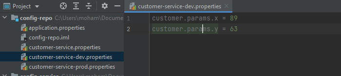
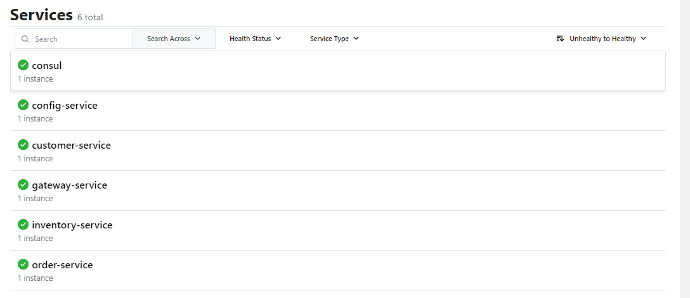

<h1 align="center">🌛 سبحان الله وبحمده، والحمد لله، ولا إله إلا الله، والله أكبر 🌜</h1>
<h1 align="center">Mohamed ELYOUSFI</h1>
<h3 align="center"><💻 Mise en oeuvre d'une architecture Micro-Services (consul) 💻/></h3>  

    
 
        <h5>📌 Démarrage du consul</h5>
        
        
        <h5>📌 Configuration Service</h5>
        
        <h5>📌 Configuration Repository</h5>
        
un repository git qui contient les fichiers de configuration de l'application

        
        <h5>📌 Configuration du customer-service default/dev/prod</h5>
        
        
        
        
c'est la même chose pour les autres services

        <h5>📌 Configuration du config-service</h5>
        
pour que le config-service puisse accéder au repository git

        
        <h5>📌 Aprés démarrage - config service</h5>
        
on peut voir que le config-service est enregistré dans le consul

        
        
Default configuration du customer-service

        
        
Configuration dev du customer-service

        
        
Configuration prod du customer-service

        
        <h5>📌 Test de la configuration de customer-service</h5>
        
        
Controlleur de test

        
        <h5>📌 Aprés démarrage - customer service</h5>
        
        
Récupération des paramètres de configuration

        
        
Pour une configuration a chaud, il faut faire un refresh du config-service, pour que le customer-service puisse récupérer les nouvelles configurations, et pour cela on utilise refresh actuator

        <h5>📌 Changement de configuration</h5>
        
        
        <h5>📌 Aprés refresh</h5>
        
        
        

        
📌 1. CUSTOMER-SERVICE (Click to expand 🖱)

        <h5>Entity Customer</h5>
        
        <h5>Repository CustomerRepository</h5>
        
        <h5>Données de test</h5>
        
        
        

        

        
📌 2. GATEWAY-SERVICE (Click to expand 🖱)

        <h5>Bean de configuration</h5>
        
        <h5>Configuration de la Gateway</h5>
        
        <h5>Aprés démarrage - gateway service</h5>
        
        <h5>Test de la gateway</h5>
        
        
        <h5>Projection - fullCustomer</h5>
        
        >
        

        

        
📌 3. INVENTORY-SERVICE (Click to expand 🖱)

        <h5>Entity Product</h5>
        
        <h5>Repository ProductRepository</h5>
        
        <h5>Données de test</h5>
        
        <h5>Configuration</h5>
        
        
        <h5>Aprés démarrage - inventory service</h5>
        
        <h5>Test de l'inventory service</h5>
        
        
        <h5>Projection - fullProduct</h5>
        
        
        

        

        
📌 4. ORDER-SERVICE (Click to expand 🖱)

        <h5>Entity Order</h5>
        
        
        <h5>Entity ProductItem</h5>
        
        <h5>Class Customer</h5>
        
        <h5>Class Product</h5>
        
        <h5>Repository OrderRepository</h5>
        
        <h5>Repository ProductItemRepository</h5>
        
        <h5>Dependencies - openfeign & hateoas</h5>
        
        <h5>Customer Rest Client</h5>
        
        <h5>Inventory Rest Client</h5>
        
        <h5>Configuration</h5>
        
        
        <h5>Données de test</h5>
        
        <h5>Aprés démarrage - order service</h5>
        
        
        
        
        
        <h5>fullOrder</h5>
        
        

        

<!--  -->
